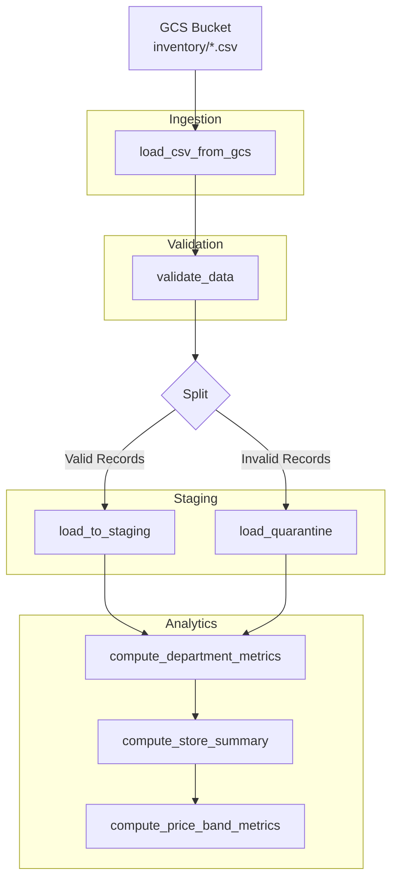
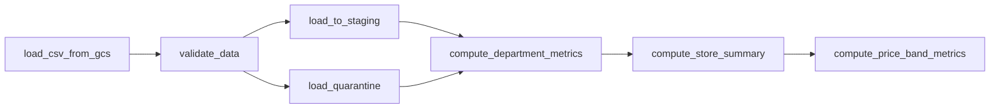
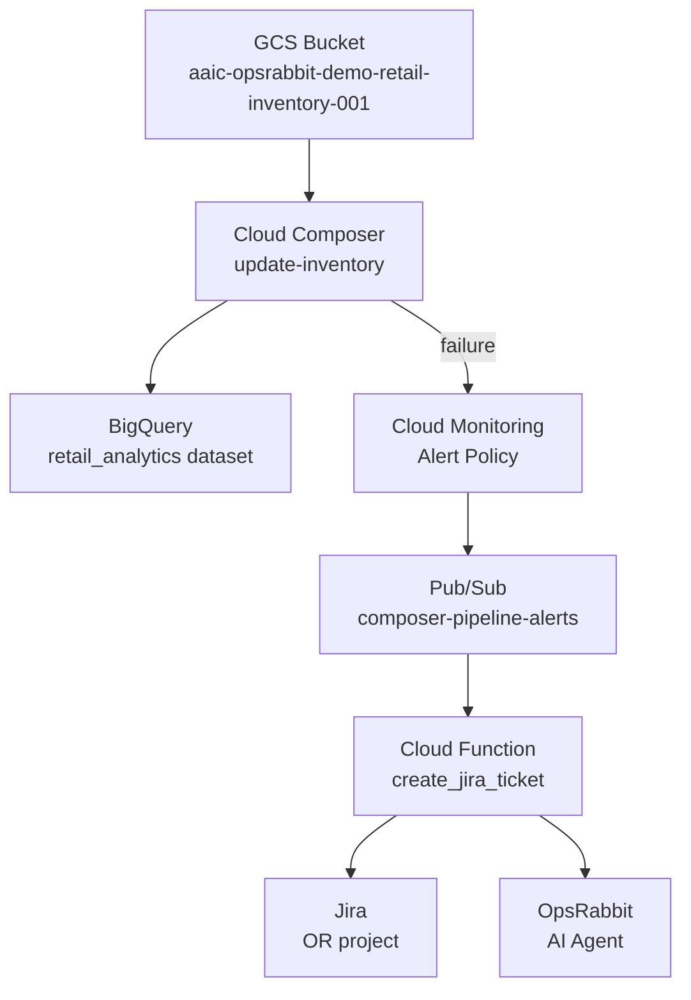

# Design Document: Macy's Inventory Pipeline

## Overview

This design enhances the existing simple 4-task Airflow DAG (`daily_inventory_pipeline`) into a production-grade multi-store inventory reconciliation pipeline. The enhanced pipeline:

1. Ingests daily CSV feeds with 16 columns from 10+ Macy's-like retail stores
2. Validates records against 7 business rules (negative inventory, margin violations, SKU/store format, staleness, implausible quantity, missing fields)
3. Quarantines bad records to a dedicated BigQuery table with rejection reasons
4. Stages clean data with full schema fidelity (partitioned, clustered)
5. Computes three analytics layers: department-level, store-level, and price-band metrics
6. Integrates with the existing alerting chain (Cloud Monitoring → Pub/Sub → Cloud Function → Jira → OpsRabbit)

The pipeline runs in Cloud Composer 2 (Airflow 2.10.5) on GCP project `aaic-opsrabbit-demo`, reading from GCS bucket `aaic-opsrabbit-demo-retail-inventory-001` and writing to BigQuery dataset `retail_analytics`.

## Architecture

### High-Level Data Flow



### DAG Task Dependency Graph



### Infrastructure Context



### Design Decisions

| Decision | Choice | Rationale |
|----------|--------|-----------|
| Data passing between tasks | XCom (JSON-serialized lists) | Existing pattern; data volume (50–200 rows per run) is well within XCom limits |
| Parallel staging + quarantine | Airflow parallel tasks with trigger_rule | Both must complete before analytics; quarantine is skipped when no rejects |
| Partition strategy | `last_updated` for staging, `pipeline_execution_date` for quarantine, `report_date` for analytics | Enables efficient date-range queries and partition replacement for idempotency |
| Idempotency approach | DELETE + INSERT within same partition | Simple, reliable for small data volumes; avoids MERGE complexity |
| Threshold check location | Within `validate_data` task (raises error) | Fails fast before any BigQuery writes |
| Analytics computation | SQL queries in BigQuery (not Python) | Leverages BigQuery's engine for aggregation; avoids pulling data back to worker |

## Components and Interfaces

### DAG File: `inventory_pipeline_dag.py`

The DAG is organized into 4 task groups:

#### Task Group: `ingestion`
| Task | Function | Input | Output (XCom) |
|------|----------|-------|----------------|
| `load_csv_from_gcs` | Downloads CSV from `gs://{BUCKET}/inventory/inventory_{ds}.csv` | Airflow `ds` context | `inventory_rows`: list of dicts |

#### Task Group: `validation`
| Task | Function | Input | Output (XCom) |
|------|----------|-------|----------------|
| `validate_data` | Applies 7 validation rules, splits records | `inventory_rows` | `valid_rows`: list of dicts, `quarantine_rows`: list of dicts with `rejection_reasons` and `raw_record` |

#### Task Group: `staging`
| Task | Function | Input | Output |
|------|----------|-------|--------|
| `load_to_staging` | Inserts valid records into `staging_inventory` | `valid_rows` | BigQuery rows inserted |
| `load_quarantine` | Inserts rejected records into `quarantine_records` | `quarantine_rows` | BigQuery rows inserted (or SKIPPED if empty) |

#### Task Group: `analytics`
| Task | Function | Input | Output |
|------|----------|-------|--------|
| `compute_department_metrics` | SQL aggregation by store+department | `staging_inventory` table | `inventory_by_department` rows |
| `compute_store_summary` | SQL aggregation by store | `staging_inventory` table | `inventory_summary` rows |
| `compute_price_band_metrics` | SQL aggregation by store+price_band | `staging_inventory` table | `inventory_by_price_band` rows |

### Validation Rules Engine

```python
VALIDATORS = [
    ("negative_inventory", lambda r: int(r["inventory_count"]) < 0),
    ("invalid_margin", lambda r: (
        float(r["unit_cost"]) <= 0 or
        float(r["retail_price"]) <= 0 or
        float(r["unit_cost"]) >= float(r["retail_price"])
    )),
    ("malformed_sku", lambda r: not re.match(r"^[A-Z]{3}-[A-Z]{3}-\d{6}$", r["sku_id"])),
    ("malformed_store_id", lambda r: not re.match(r"^[A-Z]{2}[A-Z]{3}-\d{3}$", r["store_id"])),
    ("stale_data", lambda r: is_stale(r["last_updated"], execution_date, days=7)),
    ("implausible_quantity", lambda r: int(r["inventory_count"]) > 10000),
    ("missing_required_field", lambda r: has_missing_fields(r, REQUIRED_FIELDS)),
]
```

Each validator returns `True` if the record **fails** (should be rejected). A record may fail multiple validators; all applicable reasons are collected.

### Interfaces

**GCS → DAG**: CSV file at path `inventory/inventory_{YYYY_MM_DD}.csv` with 16-column header.

**DAG → BigQuery**: 
- `staging_inventory`: partition-replace by `last_updated`
- `quarantine_records`: partition-replace by `pipeline_execution_date`
- `inventory_by_department`: partition-replace by `report_date`
- `inventory_by_price_band`: partition-replace by `report_date`
- `inventory_summary`: full table replace

**DAG → Cloud Monitoring**: Pipeline failure triggers existing alert policy via log-based detection (no changes needed to alerting chain).

## Data Models

### CSV Input Schema (Inventory_Feed)

| Column | Type | Format | Example | Required |
|--------|------|--------|---------|----------|
| sku_id | string | `{3_LETTERS}-{3_LETTERS}-{6_DIGITS}` | `WMN-DRS-004521` | Yes |
| store_id | string | `{2_LETTERS}{3_LETTERS}-{3_DIGITS}` | `NYNYC-001` | Yes |
| department | string | Enum: WMN, MEN, KID, HOM, BTY, SHO, ACC | `WMN` | Yes |
| category | string | 3-letter abbreviation | `DRS` | Yes |
| product_name | string | 2–8 words | `Classic Fit Oxford Shirt` | Yes |
| size | string | Size code or "N/A" | `M`, `8.5`, `N/A` | No |
| color | string | Color name or "N/A" | `Navy`, `N/A` | No |
| unit_cost | decimal | 2 decimal places, 0.01–999999.99 | `45.00` | Yes |
| retail_price | decimal | 2 decimal places, 0.01–999999.99 | `89.99` | Yes |
| inventory_count | integer | 0–10000 (valid range) | `142` | Yes |
| reorder_point | integer | ≥ 0 | `25` | Yes |
| warehouse_id | string | `WH-{REGION}-{NUMBER}` | `WH-EAST-01` | Yes |
| last_received_date | date | YYYY-MM-DD | `2026-03-05` | No |
| last_sold_date | date | YYYY-MM-DD | `2026-03-09` | No |
| seasonal_flag | string | "Y" or "N" | `N` | No |
| last_updated | date | YYYY-MM-DD | `2026-03-10` | Yes |

### BigQuery Tables

#### `staging_inventory` (partition: `last_updated`, cluster: `department, store_id`)

| Column | Type | Mode |
|--------|------|------|
| sku_id | STRING | REQUIRED |
| store_id | STRING | REQUIRED |
| department | STRING | REQUIRED |
| category | STRING | REQUIRED |
| product_name | STRING | REQUIRED |
| size | STRING | NULLABLE |
| color | STRING | NULLABLE |
| unit_cost | FLOAT64 | REQUIRED |
| retail_price | FLOAT64 | REQUIRED |
| inventory_count | INT64 | REQUIRED |
| reorder_point | INT64 | REQUIRED |
| warehouse_id | STRING | REQUIRED |
| last_received_date | DATE | NULLABLE |
| last_sold_date | DATE | NULLABLE |
| seasonal_flag | STRING | NULLABLE |
| last_updated | DATE | REQUIRED |
| ingestion_timestamp | TIMESTAMP | REQUIRED |

#### `quarantine_records` (partition: `pipeline_execution_date`)

| Column | Type | Mode |
|--------|------|------|
| sku_id | STRING | NULLABLE |
| store_id | STRING | NULLABLE |
| department | STRING | NULLABLE |
| category | STRING | NULLABLE |
| product_name | STRING | NULLABLE |
| inventory_count | INT64 | NULLABLE |
| retail_price | FLOAT64 | NULLABLE |
| rejection_reason | STRING | REQUIRED |
| pipeline_execution_date | DATE | REQUIRED |
| raw_record | STRING | REQUIRED |

#### `inventory_by_department` (partition: `report_date`, cluster: `department`)

| Column | Type | Mode |
|--------|------|------|
| store_id | STRING | REQUIRED |
| department | STRING | REQUIRED |
| total_skus | INT64 | REQUIRED |
| total_units | INT64 | REQUIRED |
| total_retail_value | FLOAT64 | REQUIRED |
| avg_inventory_per_sku | FLOAT64 | REQUIRED |
| below_reorder_count | INT64 | REQUIRED |
| report_date | DATE | REQUIRED |

#### `inventory_by_price_band` (partition: `report_date`)

| Column | Type | Mode |
|--------|------|------|
| store_id | STRING | REQUIRED |
| price_band | STRING | REQUIRED |
| sku_count | INT64 | REQUIRED |
| total_units | INT64 | REQUIRED |
| total_retail_value | FLOAT64 | REQUIRED |
| report_date | DATE | REQUIRED |

#### `inventory_summary`

| Column | Type | Mode |
|--------|------|------|
| store_id | STRING | REQUIRED |
| total_skus | INT64 | REQUIRED |
| total_units | INT64 | REQUIRED |
| total_retail_value | FLOAT64 | REQUIRED |
| total_cost_value | FLOAT64 | REQUIRED |
| departments_represented | INT64 | REQUIRED |
| skus_below_reorder | INT64 | REQUIRED |
| last_updated | DATE | REQUIRED |

### Price Band Classification

| Band | Range | Logic |
|------|-------|-------|
| Budget | $0 < price ≤ $50 | `retail_price <= 50` |
| Mid | $50 < price ≤ $200 | `retail_price > 50 AND retail_price <= 200` |
| Premium | $200 < price ≤ $500 | `retail_price > 200 AND retail_price <= 500` |
| Luxury | price > $500 | `retail_price > 500` |


## Correctness Properties

*A property is a characteristic or behavior that should hold true across all valid executions of a system — essentially, a formal statement about what the system should do. Properties serve as the bridge between human-readable specifications and machine-verifiable correctness guarantees.*

### Property 1: SKU Format Validator Correctness

*For any* string, the SKU validator SHALL accept it if and only if it matches the regex `^[A-Z]{3}-[A-Z]{3}-\d{6}$`. Valid SKUs pass validation without rejection; invalid SKUs are rejected with reason "malformed_sku".

**Validates: Requirements 1.2, 2.3**

### Property 2: Store ID Format Validator Correctness

*For any* string, the store ID validator SHALL accept it if and only if it matches the regex `^[A-Z]{2}[A-Z]{3}-\d{3}$`. Valid store IDs pass validation without rejection; invalid store IDs are rejected with reason "malformed_store_id".

**Validates: Requirements 1.3, 2.4**

### Property 3: Margin Validator Correctness

*For any* pair of numeric values (unit_cost, retail_price), the margin validator SHALL reject the record with reason "invalid_margin" if and only if unit_cost ≤ 0 OR retail_price ≤ 0 OR unit_cost ≥ retail_price.

**Validates: Requirements 1.6, 2.2**

### Property 4: Inventory Count Range Validator

*For any* integer inventory_count value, the validator SHALL reject with reason "negative_inventory" if inventory_count < 0, and SHALL reject with reason "implausible_quantity" if inventory_count > 10000. Values in the range [0, 10000] SHALL NOT be rejected by these validators.

**Validates: Requirements 2.1, 2.6**

### Property 5: Staleness Validator Correctness

*For any* last_updated date and pipeline execution date, the staleness validator SHALL reject the record with reason "stale_data" if and only if last_updated is more than 7 days before the pipeline execution date (i.e., execution_date - last_updated > 7 days).

**Validates: Requirements 2.5**

### Property 6: Missing Required Field Validator

*For any* record where at least one of the 11 required fields (sku_id, store_id, department, category, product_name, unit_cost, retail_price, inventory_count, reorder_point, warehouse_id, last_updated) is null or empty string, the validator SHALL reject the record with reason "missing_required_field".

**Validates: Requirements 2.7**

### Property 7: Multi-Rule Failure Collection

*For any* record that violates N validation rules (where N ≥ 1), the validator output SHALL contain exactly N rejection reasons, and the set of reasons SHALL equal the set of all validators that the record fails.

**Validates: Requirements 2.8**

### Property 8: Batch Rejection Threshold

*For any* batch of records where the number of rejected records divided by total records exceeds 0.10, the pipeline SHALL raise an error. For any batch where the ratio is ≤ 0.10, the pipeline SHALL NOT raise a threshold error.

**Validates: Requirements 2.9**

### Property 9: Department Aggregation Correctness

*For any* set of valid inventory records, the department aggregation SHALL produce correct metrics per (store_id, department) group: total_skus equals the count of distinct sku_id values, total_units equals the sum of inventory_count, total_retail_value equals the sum of (retail_price × inventory_count), avg_inventory_per_sku equals total_units / total_skus rounded to 2 decimal places, and below_reorder_count equals the count of records where inventory_count < reorder_point.

**Validates: Requirements 5.1, 5.3**

### Property 10: Store Summary Correctness

*For any* set of valid inventory records, the store summary SHALL produce one row per store with correct metrics: total_skus equals count of distinct sku_id, total_units equals sum of inventory_count, total_retail_value equals sum of (retail_price × inventory_count), total_cost_value equals sum of (unit_cost × inventory_count), departments_represented equals count of distinct departments, skus_below_reorder equals count of SKUs where inventory_count < reorder_point.

**Validates: Requirements 6.1**

### Property 11: Reorder Warning Threshold

*For any* store where skus_below_reorder / total_skus > 0.20, the pipeline SHALL log a warning. For any store where the ratio is ≤ 0.20, no warning SHALL be logged for that store.

**Validates: Requirements 6.3**

### Property 12: Price Band Classification Correctness

*For any* retail_price > 0, the price band classifier SHALL return: "Budget" if price ≤ 50, "Mid" if 50 < price ≤ 200, "Premium" if 200 < price ≤ 500, "Luxury" if price > 500. The classification SHALL be exhaustive (every positive price maps to exactly one band) and deterministic.

**Validates: Requirements 7.1**

## Error Handling

### Validation Errors (Record-Level)

| Error | Detection | Action | Recovery |
|-------|-----------|--------|----------|
| Negative inventory | `inventory_count < 0` | Quarantine record | Continue processing remaining records |
| Invalid margin | `unit_cost <= 0 OR retail_price <= 0 OR unit_cost >= retail_price` | Quarantine record | Continue processing |
| Malformed SKU | Regex mismatch | Quarantine record | Continue processing |
| Malformed store ID | Regex mismatch | Quarantine record | Continue processing |
| Stale data | `execution_date - last_updated > 7 days` | Quarantine record | Continue processing |
| Implausible quantity | `inventory_count > 10000` | Quarantine record | Continue processing |
| Missing required field | Null/empty check on 11 fields | Quarantine record | Continue processing |

### Pipeline-Level Errors

| Error | Detection | Action | Recovery |
|-------|-----------|--------|----------|
| Rejection threshold exceeded | `rejected_count / total_count > 0.10` | Fail DAG run | Manual investigation; fix source data; re-trigger DAG |
| CSV file not found | GCS download raises `NotFound` | Fail `load_csv_from_gcs` task | Verify file upload; re-trigger |
| Empty CSV file | Zero rows after parsing | Fail `load_csv_from_gcs` task | Investigate upstream data source |
| BigQuery staging write failure | Client exception during insert | Remove partial data from affected partitions; fail task | Re-trigger after BQ issue resolves |
| BigQuery quarantine write failure | Client exception during insert | Fail pipeline; log error with count | Re-trigger after BQ issue resolves |
| Malformed CSV (wrong column count) | DictReader key mismatch | Fail `load_csv_from_gcs` task | Fix source CSV; re-trigger |

### Alerting Chain Integration

When the DAG fails:
1. Cloud Composer logs the failure with severity ≥ ERROR
2. Cloud Monitoring alert policy detects the log entry (existing `composer_task_failure` policy)
3. Alert fires to Pub/Sub topic `composer-pipeline-alerts`
4. Cloud Function `create_jira_ticket` creates a Jira bug in project OR
5. Cloud Function also notifies OpsRabbit AI agent via webhook

No changes are needed to the existing alerting infrastructure. The enhanced DAG produces the same log patterns that the existing alert policy detects.

## Testing Strategy

### Unit Tests (Python — pytest)

Unit tests validate specific examples and edge cases for the validation and aggregation logic:

| Test Area | Examples |
|-----------|----------|
| CSV parsing | Correct header detection, missing columns, extra columns |
| Individual validators | One example per validator showing accept/reject |
| Quarantine row construction | Verify raw_record preserves original CSV line |
| Price band boundaries | Test exact boundary values ($50.00, $200.00, $500.00) |
| Aggregation edge cases | Single record per group, zero inventory, empty groups |
| Threshold boundary | Exactly 10% rejection rate (should NOT trigger), 10.01% (should trigger) |
| DAG structure | Task dependencies, task group membership |

### Property-Based Tests (Python — Hypothesis)

Property-based tests verify universal properties across generated inputs with minimum 100 iterations each. The `hypothesis` library will be used for property-based testing.

Each test is tagged with a comment referencing the design property:
```python
# Feature: macys-inventory-pipeline, Property 1: SKU format validator correctly classifies all strings
```

| Property | Generator Strategy |
|----------|-------------------|
| P1: SKU validator | Generate random strings mixing valid `[A-Z]{3}-[A-Z]{3}-\d{6}` with arbitrary strings |
| P2: Store ID validator | Generate random strings mixing valid `[A-Z]{2}[A-Z]{3}-\d{3}` with arbitrary strings |
| P3: Margin validator | Generate random float pairs for unit_cost and retail_price |
| P4: Inventory count range | Generate random integers including negatives and values > 10000 |
| P5: Staleness validator | Generate random date pairs (last_updated, execution_date) |
| P6: Missing fields | Generate records with random subsets of required fields emptied |
| P7: Multi-rule failures | Generate records that violate random subsets of validators |
| P8: Batch threshold | Generate batches with random valid/invalid mixes around 10% boundary |
| P9: Department aggregation | Generate random sets of inventory records, compute expected aggregation in Python |
| P10: Store summary | Generate random inventory records, compute expected store metrics in Python |
| P11: Reorder warning | Generate stores with random SKU counts and below-reorder counts around 20% |
| P12: Price band classification | Generate random positive floats, verify classification against boundary rules |

### Integration Tests

Integration tests validate BigQuery operations and end-to-end pipeline behavior:

| Test | Approach |
|------|----------|
| Staging partition replacement | Load data twice for same date, verify no duplicates |
| Quarantine idempotency | Run pipeline twice for same date, verify quarantine is replaced |
| Full pipeline happy path | Run with sample data, verify all 5 tables populated correctly |
| Failure scenario CSVs | Upload each `fail_*` CSV, verify expected pipeline behavior |
| DAG task state (quarantine skip) | Run with all-valid data, verify quarantine task is SKIPPED |

### Test File Organization

```
tests/
├── unit/
│   ├── test_validators.py          # Unit tests for each validator
│   ├── test_aggregations.py        # Unit tests for aggregation logic
│   └── test_csv_parsing.py         # Unit tests for CSV parsing
├── property/
│   ├── test_validator_properties.py # Properties 1-8
│   └── test_aggregation_properties.py # Properties 9-12
└── integration/
    ├── test_bigquery_operations.py  # Staging/quarantine idempotency
    └── test_pipeline_e2e.py         # Full pipeline runs
```

### Test Configuration

- **Property tests**: Minimum 100 iterations per property (`@settings(max_examples=100)`)
- **Integration tests**: Require GCP credentials and BigQuery access
- **Unit tests**: Pure Python, no external dependencies beyond the DAG code
- **CI**: Unit + property tests run on every commit; integration tests run nightly or on-demand
